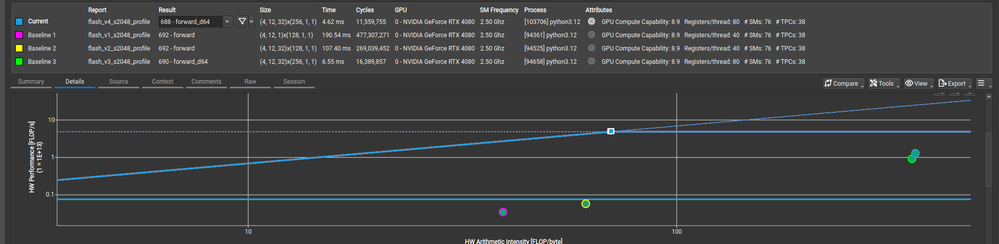

# FlashAttention-2

Pedagogical project implementing multi-head attention forward passes with CUDA kernels.

## Usage

```python
import torch

import flash_attention_v4

q = torch.randn(2, 3, 32, 64, device="cuda")
k = torch.randn_like(q)
v = torch.randn_like(q)

out = flash_attention_v4.forward(q, k, v)
```

## Results

Primary shape: `B=4, H=12, M=N=2048, D=64, dtype=float32` (all implementations are non-causal).
The table below was measured with 5 warmups and 10 repetitions. The benchmark
command defaults to 25 warmups and 100 repetitions for more stable results.

### Roofline



From left to right, each circle represents v1, v2, v3, and v4 (top right).

The combined Nsight Compute roofline shows the optimization progression from V1
through V4. A fresh standalone profile of the current V4 kernel places it on
the compute-bound side of the FP32 ridge and reaches 29% of peak FP32
throughput. The image predates V4's selective 32-bit indexing optimization, but
the resulting upward movement is small on its logarithmic scale.

### Implementations

| Version | Title | Latency (µs) | Δ vs. baseline | Description |
| --- | --- | ---: | ---: | --- |
| Baseline | Naive PyTorch | 11940.15 | — | Explicit PyTorch attention used as the correctness and latency reference |
| SDPA | PyTorch SDPA | 5507.07 | −53.9% | Optimized PyTorch reference with automatic CUDA backend selection |
| V0 | Naive CUDA | 41232.39 | +245.3% | Unfused CUDA kernels that materialize the attention matrix |
| V1 | FlashAttention-1 | 241906.59 | +1926.0% | Fused tiled online softmax with one block per batch and head |
| V2 | Simplified FlashAttention-2 | 128997.28 | +980.4% | FA2-style query-tile parallelism, but most state still lives in shared memory |
| V3 | Warp-local FlashAttention-2 | 7790.91 | −34.8% | V3 with warp-owned softmax/output state, register-blocked QK and PV, and reused K/V shared storage |
| V4 | Optimized V3 | 3810.30 | −68.1% | V3 with vectorized copies, forced inlining, padded shared K rows, and selective 32-bit indexing |

At `M=N=2048`, V4 was 1,696.77 µs, or 30.8%, faster than SDPA.

The CUDA implementations accept contiguous CUDA `float32` tensors. V0 requires self-attention
with `M = N`. V1–V4 accept Q `[B, H, M, D]` and K/V `[B, H, N, D]`.
V3 and V4 hardcode their CUDA kernels to `D=64` for simplicity and redirect
other head dimensions to V2.

## Notes

The fused kernels were profiled on an original RTX 4080 using the primary
benchmark shape. Baseline has no project CUDA kernel. V0 launches several
kernels that use 8–37 registers per thread, so it does not have one register
count or occupancy result. SDPA is an external PyTorch reference, so it is not
included in the project-kernel profiling tables.

### V1: FlashAttention-1

| Metric | Value | Interpretation |
| --- | ---: | --- |
| Profiled duration | 190.54 ms | — |
| FP32 throughput | 0.336 TFLOP/s | About 0.7% of the FP32 roofline peak |
| Arithmetic intensity | 43.38 FLOP/byte | On the memory-bound side of the FP32 ridge |
| DRAM bandwidth | 7.76 GB/s | Achieved roofline traffic |
| Occupancy | 8.33% achieved | 16.67% theoretical |
| Theoretical blocks/SM | 2 | Limited by shared memory |
| Registers | 40/thread | — |
| Shared memory | 38.40 KB/block | 37.38 KB dynamic |

V1 follows the basic FA1 idea. It avoids the full attention matrix and extra
transposes, and it uses warp reductions for softmax. Its biggest problem is the
grid. It launches one block per `(batch, head)`, which gives us only 48 blocks
for this benchmark. The RTX 4080 has 76 SMs, so some of them never get any work.

Shared memory also limits how many blocks can run on each SM. The kernel could
reach eight active warps per SM in theory, but I measured only four. With so few
active warps, the SM has little other work available while instructions or
memory accesses are waiting, resulting in poor latency hiding. The next step is
to split the work into independent query tiles like FA2 instead of trying to
tune a launch with only 48 blocks.

### V2: Simplified FlashAttention-2

| Metric | Value | Interpretation |
| --- | ---: | --- |
| Profiled duration | 107.44 ms | — |
| FP32 throughput | 0.562 TFLOP/s | About 1.2% of the FP32 roofline peak |
| Arithmetic intensity | 70.30 FLOP/byte | Approximately at the FP32 ridge |
| DRAM bandwidth | 7.99 GB/s | Achieved roofline traffic |
| Occupancy | 8.35% achieved | 8.33% theoretical |
| Theoretical blocks/SM | 1 | Limited by shared memory |
| Registers | 40/thread | — |
| Shared memory | 59.39 KB/block | 58.37 KB dynamic |

V2 adds FA2-style query tiles and gives each warp complete score rows. That
raises the grid from 48 blocks to 1,536, so there is plenty of work for every SM.
Unfortunately, despite this better grid organization, per-SM occupancy remains
low because V2 still keeps `m`, `l`, `O`, and the temporary softmax state in
shared memory along with the Q/K/V and S/P tiles.

That adds up to 58.37 KB of dynamic shared memory per block, or 59.39 KB after
including the driver's 1.02 KB reservation. As a result, each SM can hold only
one 128-thread block, or four resident warps. Theoretical occupancy is 8.33%,
closely matching the measured 8.35%. The clear next step is to move the running
softmax state and output into registers and reuse the shared buffers.

### V3: Warp-local FlashAttention-2

| Metric | Value | Interpretation |
| --- | ---: | --- |
| Profiled duration | 6.53 ms | — |
| FP32 throughput | 8.89 TFLOP/s | About 18% of the FP32 roofline peak |
| Arithmetic intensity | 362.30 FLOP/byte | On the compute-bound side of the FP32 ridge |
| DRAM bandwidth | 24.54 GB/s | Achieved roofline traffic |
| Occupancy | 48.44% achieved | 50.00% theoretical |
| Theoretical blocks/SM | 3 | Limited jointly by registers and shared memory |
| Registers | 80/thread | — |
| Shared memory | 33.79 KB/block | 32.77 KB dynamic |

V3 uses `D=64` because it makes the warp-local state easy to express with
fixed-size per-thread arrays that the compiler can keep in registers. Other head
dimensions fall back to V2. Each block has 8 warps, and each warp owns 8
query and output rows. Warp shuffles copy the running maximum and denominator
across the lanes. Each lane keeps its own output columns in registers.

Unlike V2, V3 does not need shared memory for `m_i`, `l_i`, or the unnormalized
`O_i`. Each warp keeps that state in per-thread registers. Only Q and the
unnormalized P tile stay in shared memory, while K and V take turns using the
same shared tile. This cuts shared memory from 58.37 KB in V2 to 32.77 KB. With
`B_r=64`, `B_c=32`, and `D=64`, the calculation is:

```text
sQ:    64 × 64 = 4,096 floats
sK/V:  32 × 64 = 2,048 floats
sP:    64 × 32 = 2,048 floats
total: 8,192 floats × 4 bytes = 32,768 bytes
```

With 80 registers per thread, a SM can run three blocks. That gives us 24
active warps out of 48, so theoretical occupancy is 50% (measured 48.44%).

The block size is important because the GPU places a whole block on a SM. A
256-thread block gives us the 8 warps needed for this row mapping while
still letting three blocks fit.

### V4: Optimized V3

| Metric | Value | Interpretation |
| --- | ---: | --- |
| Profiled duration | 4.12 ms | — |
| FP32 throughput | 14.10 TFLOP/s | About 29% of the FP32 roofline peak |
| Arithmetic intensity | 376.36 FLOP/byte | On the compute-bound side of the FP32 ridge |
| DRAM bandwidth | 37.47 GB/s | Achieved roofline traffic |
| Occupancy | 48.39% achieved | 50.00% theoretical |
| Theoretical blocks/SM | 3 | Limited jointly by registers and shared memory |
| Registers | 80/thread | — |
| Shared memory | 33.92 KB/block | 32.90 KB dynamic |

V4 keeps the same algorithm and warp mapping as V3. It just adds a few
lower-level CUDA optimizations. Together, they cut latency from 7,790.91 µs to
3,810.30 µs, which saves 3,980.61 µs or 51.1%.

The profiled duration was collected under Nsight Compute and is distinct from
the standalone timing benchmark.

Trying to force every loop to unroll made things worse. Register use went from
80 to 91 per thread, so only two blocks could fit on each SM instead of three.

Using aligned vector copies for Q, K, and V cut latency from 7,778.20 µs to
7,243.62 µs. That saved 534.58 µs or 6.9%.

I also pad each shared K row from 64 to 65 floats. This stops the QK reads from
hitting the same shared-memory bank and cut latency from 7,243.62 µs to
5,393.84 µs. That saved another 1,849.78 µs or 25.5%. The padding adds 32
floats, increasing dynamic shared memory from 32,768 to 32,896 bytes.

Using `int` selectively for bounded tile, row, warp, lane, and loop indices
provided another substantial gain while retaining `std::size_t` for global
memory offsets. The benchmark measured 3,810.30 µs with
selective 32-bit indexing, saving another 1,561.19 µs or 29.1%. The 32-bit
indices avoid unnecessary 64-bit integer arithmetic in the kernel's hot loops,
while the explicitly widened global offsets can still address the complete
tensors.

The next things to try are tensor-core MMA for QK and PV, and some careful
register-tile tuning that still lets more than one block fit on a SM.

## Commands

### Setup

Requires Python 3.12, CUDA-enabled PyTorch, a compatible CUDA toolkit with `nvcc`, and a
CUDA-compatible C++20 compiler.

```bash
uv venv --python 3.12 .venv
source .venv/bin/activate
python -m pip install -r requirements.txt
python setup.py build_ext --inplace
```

After adding, renaming, or moving a CUDA extension, force an in-place rebuild so
stale incremental build artifacts are not reused:

```bash
python setup.py build_ext --inplace --force
```

To target a different GPU architecture:

```bash
TORCH_CUDA_ARCH_LIST=<value> python setup.py build_ext --inplace
```

### Tests

```bash
python -m pytest -q
```

For CUDA memory checks:

```bash
compute-sanitizer --target-processes all python -m pytest -q
```

### Benchmarks

The fixed suite measures `M=N=512, 1024, 2048` at `B=4, H=12, D=64`, using 25 warmups and 100
timed calls.

Benchmark every registered implementation:

```bash
python benchmark.py all
```

Or benchmark one implementation:

```bash
python benchmark.py v4
```

The required implementation argument accepts `all`, `baseline`, `sdpa`, and
`v0` through `v4`.

The shape and timing counts can be overridden for larger, shorter benchmark runs:

```bash
python benchmark.py v4 \
  --batch-size 1 \
  --num-heads 32 \
  --head-dim 64 \
  --seq-lens 4096 \
  --warmup 5 \
  --repetitions 10
```

### Profiling

Profiling commands cover the project's fused implementations. Baseline and V0
launch multiple kernels, so a single roofline or occupancy value would be
ambiguous. SDPA is handled inside PyTorch and is not profiled here.

`profile.sh` captures the roofline, occupancy, and launch statistics in one report. Profile one
fused implementation:

```bash
./profile.sh v4
```

Or profile every registered fused implementation:

```bash
./profile.sh all
```

`all` skips baseline, SDPA, and V0. Passing one of them directly is an error. If
non-admin GPU performance counters are disabled, run the script with `sudo`.
It uses the repository's virtual environment by absolute path.

Reports are saved as `/tmp/flash_<implementation>_s2048_profile.ncu-rep`.

Open the report:

```bash
ncu-ui /tmp/flash_v4_s2048_profile.ncu-rep
```

Open all four reports:

```bash
ncu-ui \
  /tmp/flash_v1_s2048_profile.ncu-rep \
  /tmp/flash_v2_s2048_profile.ncu-rep \
  /tmp/flash_v3_s2048_profile.ncu-rep \
  /tmp/flash_v4_s2048_profile.ncu-rep
```

Print occupancy and launch statistics:

```bash
/usr/local/cuda/bin/ncu \
  --import /tmp/flash_v4_s2048_profile.ncu-rep \
  --page details \
  --section Occupancy \
  --section LaunchStats
```

Print the roofline overview:

```bash
/usr/local/cuda/bin/ncu \
  --import /tmp/flash_v4_s2048_profile.ncu-rep \
  --page details \
  --section SpeedOfLight_RooflineChart \
  --print-details all
```

## Extended notes

- [V1 extended notes](docs/v1-extended-notes.md)
- [V2 extended notes](docs/v2-extended-notes.md)

## Sources

1. [FlashAttention](https://arxiv.org/abs/2205.14135)
2. [FlashAttention-2: Faster Attention with Better Parallelism and Work Partitioning](https://arxiv.org/abs/2307.08691)
3. [From Online Softmax to FlashAttention](https://courses.cs.washington.edu/courses/cse599m/23sp/notes/flashattn.pdf)
