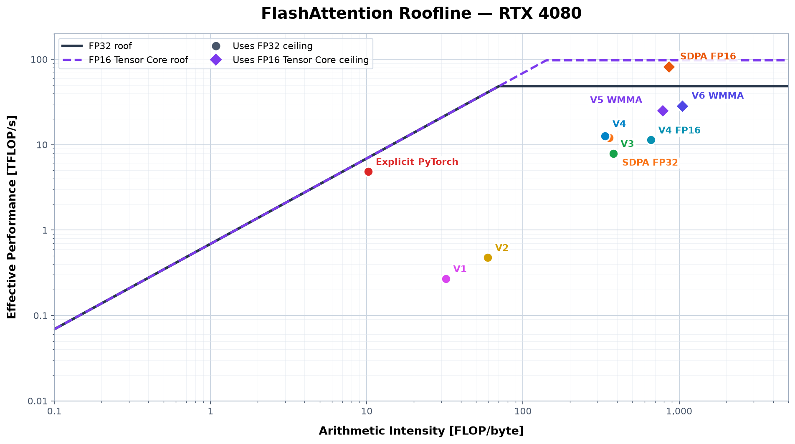

# FlashAttention-2

Pedagogical CUDA implementations of multi-head attention forward passes.

## Usage

```python
import torch
import flash_attention_v6

q = torch.randn(2, 3, 32, 64, device="cuda", dtype=torch.float16)
k = torch.randn_like(q)
v = torch.randn_like(q)

out = flash_attention_v6.forward(q, k, v)
```

## Build, test, and profile

See [Operations](docs/operations.md) for setup, tests, accuracy checks,
benchmarks, and Nsight Compute profiling.

## Results

SDPA refers to PyTorch's
`torch.nn.functional.scaled_dot_product_attention`. For FP32 at the primary
shape, it dispatches to fused CUTLASS memory-efficient attention because its
FlashAttention backend requires FP16 or BF16 inputs in this environment.

All benchmarks use `B=4`, `H=12`, `D=64`, `M=N`, and non-causal attention.
Each value is the median of seven randomized, interleaved samples of 50 calls,
after at least 25 warmup calls and 500 ms of completed GPU work per
implementation. The primary shape used for accuracy and profiling is
`M=N=2048`. The measurements below used a GeForce RTX 4080, driver 595.84,
PyTorch 2.12.1, and CUDA 13.0.

### Roofline



Every point divides the same algorithmic work by the complete call's Nsight
Compute duration and measured DRAM traffic. V4 FP16 uses the FP32 ceiling
because only its storage is FP16.

### Benchmarks

| Implementation | Dtype | 512 (µs) | 1024 (µs) | 2048 (µs) | Main change |
| --- | --- | ---: | ---: | ---: | --- |
| Baseline | FP32 | 472.58 | 2311.85 | 9155.29 | Explicit PyTorch attention |
| SDPA | FP32 | 311.42 | 1031.48 | 3970.91 | Optimized PyTorch reference |
| SDPA FP16 | FP16 | 52.06 | 162.69 | 598.11 | Dtype-matched optimized reference |
| V0 | FP32 | 3276.19 | 11817.45 | 35640.18 | Unfused CUDA kernels |
| V1 | FP32 | 11669.24 | 45614.24 | 184094.51 | Fused FlashAttention-1 tiling |
| V2 | FP32 | 7513.74 | 26634.99 | 102911.43 | Query-tile parallelism |
| V3 | FP32 | 460.41 | 1609.84 | 6212.01 | Warp-local register state |
| V4 | FP32 | 311.39 | 1014.80 | 3896.21 | Vectorized copies, padding, and 32-bit indexing |
| V4 FP16 | FP16 | 323.26 | 1116.17 | 4316.33 | Scalar FP16-storage baseline |
| V5 | FP16 | 144.07 | 507.37 | 1911.97 | Tensor-core WMMA for QK and PV |
| V6 | FP16 | 124.08 | 458.42 | 1696.97 | Faster exponential and warp reductions |

V0–V4 use FP32. V4 FP16 is the scalar baseline for the FP16 V5 and V6 kernels.
The SDPA rows are external references. V6 is the fastest project kernel at all
three sizes. It is 13.9%, 9.6%, and 11.2% faster than V5 at sequence lengths
512, 1024, and 2048. At 2048, it is 60.7% faster than V4 FP16, but FP16 SDPA is
64.8% faster than V6.

At 2048, V6 is also 56.4% faster than V4, the fastest FP32 project kernel, and
57.3% faster than FP32 SDPA. These are cross-dtype comparisons: V6 benefits
from FP16 storage and Tensor Cores. V4 FP16 is the direct scalar baseline.

### Accuracy

| Implementation | Input | Output | Max abs | Mean abs | RMSE | Relative L2 |
| --- | --- | --- | ---: | ---: | ---: | ---: |
| SDPA | FP32 | FP32 | 8.941e-7 | 2.482e-8 | 3.449e-8 | 9.487e-7 |
| SDPA FP16 | FP16 | FP16 | 1.098e-4 | 7.882e-6 | 1.027e-5 | 2.826e-4 |
| V4 FP16 | FP16 | FP16 | 1.098e-4 | 7.862e-6 | 1.025e-5 | 2.819e-4 |
| V5 | FP16 | FP16 | 1.098e-4 | 7.862e-6 | 1.025e-5 | 2.819e-4 |
| V6 | FP16 | FP16 | 1.098e-4 | 7.862e-6 | 1.025e-5 | 2.819e-4 |

`python -m scripts.accuracy sdpa sdpa-fp16 v4-fp16 v5 v6` produced these
against the FP32 PyTorch reference at the primary shape with seed 0. FP32 runs
use the exact FP16-generated inputs promoted to FP32.

V0–V4 use contiguous CUDA `float32`. V4 FP16, V5, V6, and FP16
SDPA use `float16`. V0 requires `M=N`. V1–V6 accept Q `[B, H, M, D]` and K/V
`[B, H, N, D]`. V3 and V4 redirect head dimensions other than `D=64` to V2,
while V4 FP16, V5, and V6 reject them.

## Profiling notes

The fused kernels were profiled with Nsight Compute on an original RTX 4080 at
`B=4`, `H=12`, `M=N=2048`, and `D=64`. These are representative profiler runs,
not the standalone benchmark timings above.
Baseline has no project kernel, V0's kernels use 8–37 registers each, and SDPA
is external, so none has a single project-kernel profile below.

| Kernel | Compute path | Duration (ms) | Registers/thread | Dynamic shared (KB/block) | Achieved occupancy |
| --- | --- | ---: | ---: | ---: | ---: |
| V1 | Scalar FP32 | 190.56 | 40 | 37.38 | 8.34% |
| V2 | Scalar FP32 | 107.29 | 40 | 58.37 | 8.33% |
| V3 | Scalar FP32 | 6.55 | 80 | 32.77 | 48.33% |
| V4 | Scalar FP32 | 4.11 | 80 | 32.90 | 48.25% |
| V4 FP16 | Scalar FP32 | 4.53 | 72 | 16.51 | 48.23% |
| V5 | FP16 Tensor Core | 2.05 | 64 | 27.14 | 48.31% |
| V6 | FP16 Tensor Core | 1.84 | 64 | 27.14 | 48.02% |

### V1: FlashAttention-1

V1 follows FA1, avoiding the full attention matrix and using warp reductions
for softmax. Its one block per `(batch, head)` yields only 48 blocks on a
76-SM GPU. The RTX 4080 supports 48 warps per SM. Shared memory caps V1 at eight
theoretical warps per SM, or 16.67% occupancy, but its small grid achieves only
four warps per SM, or 8.34%. This leaves too little work to hide latency. V2
fixes the grid by splitting queries into independent tiles.

### V2: Simplified FlashAttention-2

V2 adds FA2-style query tiles and complete score rows per warp, raising the grid
from 48 to 1,536 blocks. It still stores `m`, `l`, `O`, temporary softmax state,
and all tiles in shared memory. The resulting 59.39 KB total allocation (58.37
KB dynamic) permits only one 128-thread block, or four warps, per SM. V3 moves
running state into registers and reuses shared buffers.

### V3: Warp-local FlashAttention-2

Shared-memory conflicts are reported as conflicts divided by load or store
wavefronts, not as the percentage of instructions that conflict.

| Metric | V3 | V4 |
| --- | ---: | ---: |
| Shared-load bank conflicts / wavefronts | 46.67% | <0.01% |

V3 specializes `D=64`, using fixed-size arrays the compiler can keep in
registers, and falls back to V2 otherwise. Each of eight warps owns eight query
and output rows. Shuffles replicate softmax state across lanes, while each lane
keeps its output columns in registers.

Q and unnormalized P have dedicated shared storage, while K and V reuse one
tile. Keeping `m_i`, `l_i`, and unnormalized `O_i` in registers cuts dynamic
shared memory from 58.37 to 32.77 KB. For `B_r=64`, `B_c=32`, and `D=64`:

```text
sQ:    64 × 64 = 4,096 floats
sK/V:  32 × 64 = 2,048 floats
sP:    64 × 32 = 2,048 floats
total: 8,192 floats × 4 bytes = 32,768 bytes
```

V3 doubles V2's block size from 128 to 256 threads while keeping `B_r=64`.
The 33.79 KB allocation limits each SM to three blocks regardless of block
size. Using 256 threads fills otherwise-unused capacity without reducing block
residency (`3 × 256 = 768` of 1,536 threads/SM). This raises resident warps from
12 to 24.

### V4: Optimized V3

V4 keeps V3's algorithm and warp mapping but adds lower-level CUDA
optimizations. In the benchmark above, these changes cut latency from 6,212.01
to 3,896.21 µs, or 37.3%.

The tuning measurements below predate the standardized protocol and are
comparable only within this sequence.

Forcing every loop to unroll raised register use from 80 to 91 per thread and
reduced residency from three blocks per SM to two.

Aligned Q/K/V vector copies cut latency from 7,778.20 to 7,243.62 µs, or 6.9%.

Padding shared K rows from 64 to 65 floats prevents QK reads from repeatedly
hitting one bank. It cut latency from 7,243.62 to 5,393.84 µs, or 25.5%, while
adding 128 bytes of dynamic shared memory.

Selective 32-bit indexing cut latency to 3,810.30 µs, another 29.4%, by avoiding
64-bit arithmetic in hot loops. Global offsets widen explicitly to
`std::size_t`.

V5 takes the next architectural step by moving both QK and PV to FP16 WMMA while
keeping their accumulations, online softmax, and running output in FP32.

### V4 FP16: FP16 storage baseline

V4 FP16 is a storage baseline for tensor cores. Q, K, V, shared P, and output
use FP16. Scores, softmax, and accumulations remain FP32.

Accuracy
| Implementation | Max abs | Mean abs | RMSE | Relative L2 |
| --- | ---: | ---: | ---: | ---: |
| V4 FP32 | 9.239e-7 | 2.928e-8 | 4.201e-8 | 1.156e-6 |
| V4 FP16 | 1.098e-4 | 7.862e-6 | 1.025e-5 | 2.819e-4 |

`python -m scripts.accuracy` produced these against the FP32 PyTorch reference
at the primary shape with seed 0. V4 and the reference receive the same FP16
inputs promoted to FP32, excluding initial rounding. These measurements are
not error bounds.

V4 FP16 took 4,316.33 µs, 10.8% slower than V4. It still converts operands
before scalar FP32 `FFMA`s, and its smaller shared allocation does not improve
residency. Registers still limit both versions to three blocks per SM.

The final SASS confirmed three `LDG.E.128` Q/K/V loads and explicit
`HADD2.F32`/`F2F` conversions. This shows that the conversions exist, not that
they are the sole cause of the regression:

```bash
cuobjdump --dump-sass flash_attention_v4_fp16*.so \
  | rg 'LDG|HADD2|F2F'
```

### V5: Tensor-core WMMA

Shared-memory profiling
| Metric | Value | Interpretation |
| --- | ---: | --- |
| Shared-load bank conflicts / wavefronts | 34.92% | Operand loads remain conflicted |
| Shared-store bank conflicts / wavefronts | 2.27% | Scratch padding kept result stores low |
| Short-scoreboard stall | 6.28 cycles/issued instruction | 45.0% of the 13.94-cycle average warp latency |

The Short Scoreboard and bank-conflict measurements are consistent with
shared-memory operand loads being V5's main remaining memory-side stall.

Accuracy
| Implementation | Max abs | Mean abs | RMSE | Relative L2 |
| --- | ---: | ---: | ---: | ---: |
| SDPA FP16 | 1.098e-4 | 7.882e-6 | 1.027e-5 | 2.826e-4 |
| V5 | 1.098e-4 | 7.862e-6 | 1.025e-5 | 2.819e-4 |

`python -m scripts.accuracy sdpa-fp16 v5` produced these against the FP32
PyTorch reference at the primary shape with seed 0. Both receive the same FP16
inputs, return FP16 outputs, and have effectively equivalent measured accuracy.

V5 uses FP16 WMMA operands and FP32 accumulators for both matrix products. Each
warp computes Q @ K as
`[8,64] @ [64,32]` and P @ V as `[8,32] @ [32,64]` using `m8n32k16` operations.
Softmax and the running output remain FP32 and register-resident.

Because WMMA hides its accumulator mapping, each warp materializes its
`[8,32]` QK or PV result in FP32 shared `sS_ij` before lanes reload their
columns. Padding its row stride from 32 to 36 floats shifts rows across banks,
cutting store conflicts from 64.46% to 2.04% and fixed-clock duration from 2.29
to 2.12 ms, or 7.4%. It adds 1.02 KB without changing residency.

Shared P uses a physical row stride of 40 halves for 32 logical columns. Its
eight-half padding cut load conflicts from 62.94 to 44.06 million, or 30.0%,
and duration from 2.12 to 2.05 ms, or 3.7%. It adds 1.03 KB without changing
residency.

This padding is specific to WMMA. Scalar V3/V4 broadcast one P element across
lanes, while WMMA distributes fragments through `LDSM` loads whose bank mapping
depends on the physical stride. V3/V4 also keep matrix-product results in known
per-lane registers and need no shared result buffer.

K and V share a padded allocation with stride `HEAD_DIM + 8 = 72`. This
smallest WMMA-compatible increment shifts rows by four banks but leaves 34.92%
shared-load conflicts.

### V6: Cheaper scalar operations

V6 retains V5's WMMA and memory layout, but replaces `expf` with `__expf` and
uses XOR warp reductions that need no final broadcast.

| Metric | V5 | V6 |
| --- | ---: | ---: |
| Profiled duration | 2.05 ms | 1.84 ms |
| Short Scoreboard | 6.28 cycles/issued instruction | 5.06 cycles/issued instruction |
| Shared-load bank conflicts / wavefronts | 34.92% | 34.90% |

The nearly identical shared-load result is expected because V6 does not change
V5's operand layout. Its improvement comes from cheaper scalar work around the
same WMMA operations.

Experiments with asynchronous staging, explicit fragment pipelines, deferred
output scaling, independent PV accumulators, and four-block residency either
regressed or added substantial complexity for small gains. The synchronous
64-register version was retained; [the V6 extended notes](docs/v6-extended-notes.md)
summarize those measurements.

## Extended notes

- [V1 extended notes](docs/v1-extended-notes.md)
- [V2 extended notes](docs/v2-extended-notes.md)
- [V3 extended notes](docs/v3-extended-notes.md)
- [V4 FP16 extended notes](docs/v4-fp16-extended-notes.md)
- [V5 extended notes](docs/v5-extended-notes.md)
- [V6 extended notes](docs/v6-extended-notes.md)

## Sources

1. [FlashAttention](https://arxiv.org/abs/2205.14135)
2. [FlashAttention-2: Faster Attention with Better Parallelism and Work Partitioning](https://arxiv.org/abs/2307.08691)
3. [From Online Softmax to FlashAttention](https://courses.cs.washington.edu/courses/cse599m/23sp/notes/flashattn.pdf)
