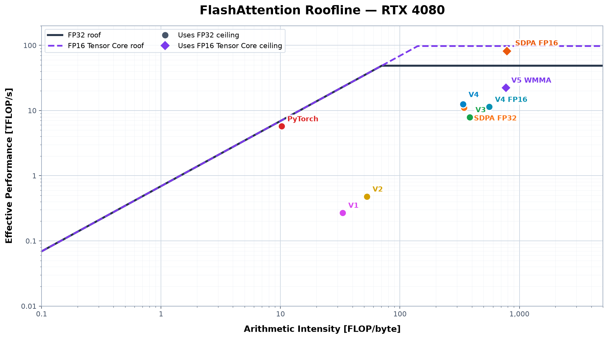

# FlashAttention-2

Pedagogical project implementing multi-head attention forward passes with CUDA kernels.

## Usage

```python
import torch
import flash_attention_v5

q = torch.randn(2, 3, 32, 64, device="cuda", dtype=torch.float16)
k = torch.randn_like(q)
v = torch.randn_like(q)

out = flash_attention_v5.forward(q, k, v)
```

## Build, test, and profile

See [Operations](docs/operations.md) for setup, tests, accuracy checks,
benchmarks, and Nsight Compute profiling.

## Results

SDPA means scaled dot-product attention and refers here to PyTorch's
`torch.nn.functional.scaled_dot_product_attention` implementation.

Primary shape: `B=4, H=12, M=N=2048, D=64` (all implementations are non-causal).
Every latency in the implementation table uses the same benchmark protocol: 25
warmups followed by 50 timed calls.

### Roofline



Every point uses the same algorithmic work divided by the complete
attention call's Nsight Compute duration and measured DRAM traffic. V4 FP16
uses the FP32 ceiling because it has FP16 storage but scalar FP32 arithmetic.

### Implementations


| Version | Title | Dtype | Latency (µs) | Δ vs. baseline | Description |
| --- | --- | --- | ---: | ---: | --- |
| Baseline | Naive PyTorch | FP32 | 9566.19 | — | Explicit PyTorch attention used as the correctness and latency reference |
| SDPA | PyTorch SDPA | FP32 | 4133.99 | −56.8% | Optimized PyTorch reference with automatic CUDA backend selection |
| SDPA FP16 | PyTorch SDPA | FP16 | 620.32 | −93.5% | Dtype-matched PyTorch reference with automatic CUDA backend selection |
| V0 | Naive CUDA | FP32 | 35748.39 | +273.7% | Unfused CUDA kernels that materialize the attention matrix |
| V1 | FlashAttention-1 | FP32 | 191148.32 | +1898.2% | Fused tiled online softmax with one block per batch and head |
| V2 | Simplified FlashAttention-2 | FP32 | 107191.30 | +1020.5% | FA2-style query-tile parallelism, but most state still lives in shared memory |
| V3 | Warp-local FlashAttention-2 | FP32 | 6476.57 | −32.3% | V2 with warp-owned softmax/output state, register-blocked QK and PV, and reused K/V shared storage |
| V4 | Optimized V3 | FP32 | 4111.20 | −57.0% | V3 with vectorized copies, forced inlining, padded shared K rows, and selective 32-bit indexing |
| V4 FP16 | FP16 storage baseline | FP16 | 4514.22 | −52.8% | V4's scalar matmuls with FP16 storage and FP32 accumulation |
| V5 | Tensor-core WMMA | FP16 | 2240.18 | −76.6% | WMMA QK and PV with FP32 accumulation and padded FP16 K/V shared rows |

At `M=N=2048`, V5 is the fastest project implementation in this table. It was
2,274.04 µs, or 50.4%, faster than the same-dtype V4 FP16 storage baseline. V5
was 1,893.81 µs, or 45.8%, faster than FP32 SDPA. The dtype-matched FP16 SDPA
reference was fastest overall at 620.32 µs, 1,619.86 µs, or 72.3%, faster than
V5.

### Accuracy

| Implementation | Input | Output | Max abs | Mean abs | RMSE | Relative L2 |
| --- | --- | --- | ---: | ---: | ---: | ---: |
| SDPA | FP32 | FP32 | 8.941e-7 | 2.482e-8 | 3.449e-8 | 9.487e-7 |
| SDPA FP16 | FP16 | FP16 | 1.098e-4 | 7.882e-6 | 1.027e-5 | 2.826e-4 |
| V4 FP16 | FP16 | FP16 | 1.098e-4 | 7.862e-6 | 1.025e-5 | 2.819e-4 |
| V5 | FP16 | FP16 | 1.098e-4 | 7.862e-6 | 1.025e-5 | 2.819e-4 |

`python accuracy.py sdpa sdpa-fp16 v4-fp16 v5` produced these against the
FP32 PyTorch reference at the primary shape with seed 0. Inputs are generated
in FP16, then promoted without changing their values for the FP32 reference
and FP32 SDPA.

V0–V4 accept contiguous CUDA `float32` tensors. V4 FP16 and V5 accept and return
`float16`. The benchmark's FP16 SDPA reference also uses `float16`. V0 requires
self-attention with `M = N`. V1–V5, including V4 FP16,
accept Q `[B, H, M, D]` and K/V `[B, H, N, D]`. V3 and V4 specialize their CUDA
kernels for `D=64` and redirect other head dimensions to V2. V4 FP16 and V5
support only `D=64` and reject unsupported inputs rather than falling back.

## Notes

`torch.cuda.get_device_properties(0)`
```
  maxThreadsPerMultiProcessor = 1,536
  maximum warps/SM = 1,536 / 32 = 48
```

The fused kernels were profiled on an original RTX 4080 using the primary
benchmark shape. Baseline has no project CUDA kernel. V0 launches several
kernels that use 8–37 registers per thread, so it does not have one register
count or occupancy result. SDPA is an external PyTorch reference, so it is not
included in the project-kernel profiling tables.

The shared-memory bank-conflict ratios below are the number of bank conflicts
divided by the total load or store wavefronts. They are not the percentage of
shared-memory instructions that encounter a conflict.

Compute throughput and arithmetic intensity follow each implementation's actual
compute path: scalar FP32 for V1 through V4 FP16 and dense FP16 Tensor Core
operations with FP32 accumulation for V5.

### V1: FlashAttention-1

Profiling
| Metric | Value | Interpretation |
| --- | ---: | --- |
| Profiled duration | 190.56 ms | Nsight Compute measurement |
| Compute-path throughput | 0.336 TFLOP/s | scalar FP32; 0.7% of its roofline peak |
| Hardware arithmetic intensity | 41.54 FLOP/byte | Hardware-executed compute-path operations per measured DRAM byte |
| DRAM bandwidth | 8.10 GB/s | Measured device-memory traffic |
| Occupancy | 8.34% achieved | 16.67% theoretical |
| Theoretical blocks/SM | 2 | Limited by shared memory |
| Registers | 40/thread | — |
| Shared memory | 38.40 KB/block | 37.38 KB dynamic |
| Shared-load bank-conflict ratio | 87.86% | Above Nsight's 10% warning threshold |
| Shared-store bank-conflict ratio | 0.00% | No measured conflicts |

V1 follows the basic FA1 idea. It avoids the full attention matrix and extra
transposes, and it uses warp reductions for softmax. Its biggest problem is the
grid. It launches one block per `(batch, head)`, which gives us only 48 blocks
for this benchmark. The RTX 4080 has 76 SMs, so some of them never get any work.

Shared memory also limits how many blocks can run on each SM. The kernel could
reach eight active warps per SM in theory, but I measured only four. With so few
active warps, the SM has little other work available while instructions or
memory accesses are waiting, resulting in poor latency hiding. The next step is
to split the work into independent query tiles like FA2 instead of trying to
tune a launch with only 48 blocks.

### V2: Simplified FlashAttention-2

Profiling
| Metric | Value | Interpretation |
| --- | ---: | --- |
| Profiled duration | 107.29 ms | Nsight Compute measurement |
| Compute-path throughput | 0.562 TFLOP/s | scalar FP32; 1.2% of its roofline peak |
| Hardware arithmetic intensity | 62.03 FLOP/byte | Hardware-executed compute-path operations per measured DRAM byte |
| DRAM bandwidth | 9.07 GB/s | Measured device-memory traffic |
| Occupancy | 8.33% achieved | 8.33% theoretical |
| Theoretical blocks/SM | 1 | Limited by shared memory |
| Registers | 40/thread | — |
| Shared memory | 59.39 KB/block | 58.37 KB dynamic |
| Shared-load bank-conflict ratio | 88.05% | Above Nsight's 10% warning threshold |
| Shared-store bank-conflict ratio | 0.00% | No measured conflicts |

V2 adds FA2-style query tiles and gives each warp complete score rows. That
raises the grid from 48 blocks to 1,536, so there is plenty of work for every SM.
Unfortunately, despite this better grid organization, per-SM occupancy remains
low because V2 still keeps `m`, `l`, `O`, and the temporary softmax state in
shared memory along with the Q/K/V and S/P tiles.

That adds up to 58.37 KB of dynamic shared memory per block, or 59.39 KB after
including the driver's 1.02 KB reservation. As a result, each SM can hold only
one 128-thread block, or four resident warps. Theoretical occupancy is 8.33%,
closely matching the measured 8.35%. The clear next step is to move the running
softmax state and output into registers and reuse the shared buffers.

### V3: Warp-local FlashAttention-2

Profiling
| Metric | Value | Interpretation |
| --- | ---: | --- |
| Profiled duration | 6.55 ms | Nsight Compute measurement |
| Compute-path throughput | 8.856 TFLOP/s | scalar FP32; 18.3% of its roofline peak |
| Hardware arithmetic intensity | 352.90 FLOP/byte | Hardware-executed compute-path operations per measured DRAM byte |
| DRAM bandwidth | 25.10 GB/s | Measured device-memory traffic |
| Occupancy | 48.33% achieved | 50.00% theoretical |
| Theoretical blocks/SM | 3 | Limited by registers, shared memory |
| Registers | 80/thread | — |
| Shared memory | 33.79 KB/block | 32.77 KB dynamic |
| Shared-load bank-conflict ratio | 46.67% | Above Nsight's 10% warning threshold |
| Shared-store bank-conflict ratio | 2.61% | Below Nsight's 10% warning threshold |

V3 uses `D=64` because it makes the warp-local state easy to express with
fixed-size per-thread arrays that the compiler can keep in registers. Other head
dimensions fall back to V2. Each block has 8 warps, and each warp owns 8
query and output rows. Warp shuffles copy the running maximum and denominator
across the lanes. Each lane keeps its own output columns in registers.

Unlike V2, V3 does not need shared memory for `m_i`, `l_i`, or the unnormalized
`O_i`. Each warp keeps that state in per-thread registers. Only Q and the
unnormalized P tile stay in shared memory, while K and V take turns using the
same shared tile. This cuts shared memory from 58.37 KB in V2 to 32.77 KB. With
`B_r=64`, `B_c=32`, and `D=64`, the calculation is:

```text
sQ:    64 × 64 = 4,096 floats
sK/V:  32 × 64 = 2,048 floats
sP:    64 × 32 = 2,048 floats
total: 8,192 floats × 4 bytes = 32,768 bytes
```

V3 doubles V2's block size from 128 to 256 threads while keeping `B_r=64`.
The fixed 33.79 KB shared allocation already limits each SM to three blocks,
and reducing the threads/block would not shrink that allocation. Using 256
threads therefore fills otherwise-unused thread capacity without reducing
block residency (`3 × 256 = 768` of 1,536 threads/SM). Eight warps own 8 rows
each instead of four warps owning 16, raising resident warps from 12 to 24 and
giving 50% theoretical occupancy (`24 / (1,536 / 32) = 50%`).

### V4: Optimized V3

Profiling
| Metric | Value | Interpretation |
| --- | ---: | --- |
| Profiled duration | 4.11 ms | Nsight Compute measurement |
| Compute-path throughput | 14.113 TFLOP/s | scalar FP32; 29.0% of its roofline peak |
| Hardware arithmetic intensity | 372.67 FLOP/byte | Hardware-executed compute-path operations per measured DRAM byte |
| DRAM bandwidth | 37.87 GB/s | Measured device-memory traffic |
| Occupancy | 48.25% achieved | 50.00% theoretical |
| Theoretical blocks/SM | 3 | Limited by registers, shared memory |
| Registers | 80/thread | — |
| Shared memory | 33.92 KB/block | 32.90 KB dynamic |
| Shared-load bank-conflict ratio | <0.01% | Below Nsight's 10% warning threshold |
| Shared-store bank-conflict ratio | 29.40% | Above Nsight's 10% warning threshold |

V4 keeps the same algorithm and warp mapping as V3. It just adds a few
lower-level CUDA optimizations. Under the standardized benchmark, they cut
latency from 6,476.57 µs to 4,111.20 µs, which saves 2,365.37 µs or 36.5%.

The profiled duration was collected under Nsight Compute and is distinct from
the standalone timing benchmark.

The step-by-step measurements below were recorded during V4 development before
the benchmark protocol was standardized. They show the effect of each change
within that tuning run and should not be compared directly with the main table.

Trying to force every loop to unroll made things worse. Register use went from
80 to 91 per thread, so only two blocks could fit on each SM instead of three.

Using aligned vector copies for Q, K, and V cut latency from 7,778.20 µs to
7,243.62 µs. That saved 534.58 µs or 6.9%.

I also pad each shared K row from 64 to 65 floats. This stops the QK reads from
hitting the same shared-memory bank and cut latency from 7,243.62 µs to
5,393.84 µs. That saved another 1,849.78 µs or 25.5%. The padding adds 32
floats, increasing dynamic shared memory from 32,768 to 32,896 bytes.

Using `int` selectively for bounded tile, row, warp, lane, and loop indices
provided another substantial gain while retaining `std::size_t` for global
memory offsets. The benchmark measured 3,810.30 µs with
selective 32-bit indexing, saving another 1,583.54 µs or 29.4%. The 32-bit
indices avoid unnecessary 64-bit integer arithmetic in the kernel's hot loops,
while the explicitly widened global offsets can still address the complete
tensors.

V5 takes the next architectural step by moving both QK and PV to FP16 WMMA while
keeping their accumulations, online softmax, and running output in FP32.

### V4 FP16: FP16 storage baseline

V4 FP16 keeps V4's scalar algorithm as a storage baseline for tensor cores. Q,
K, V, shared P, and the output use FP16; scores, softmax, and accumulations stay
FP32.

Profiling
| Metric | Value | Interpretation |
| --- | ---: | --- |
| Profiled duration | 4.53 ms | Nsight Compute measurement |
| Compute-path throughput | 12.825 TFLOP/s | scalar FP32; 26.3% of its roofline peak |
| Hardware arithmetic intensity | 858.23 FLOP/byte | Hardware-executed compute-path operations per measured DRAM byte |
| DRAM bandwidth | 14.94 GB/s | Measured device-memory traffic |
| Occupancy | 48.23% achieved | 50.00% theoretical |
| Theoretical blocks/SM | 3 | Limited by registers |
| Registers | 72/thread | — |
| Shared memory | 17.54 KB/block | 16.51 KB dynamic |
| Shared-load bank-conflict ratio | <0.01% | Below Nsight's 10% warning threshold |
| Shared-store bank-conflict ratio | 2.74% | Below Nsight's 10% warning threshold |

Accuracy
| Implementation | Max abs | Mean abs | RMSE | Relative L2 |
| --- | ---: | ---: | ---: | ---: |
| V4 FP32 | 9.239e-7 | 2.928e-8 | 4.201e-8 | 1.156e-6 |
| V4 FP16 | 1.098e-4 | 7.862e-6 | 1.025e-5 | 2.819e-4 |

`python accuracy.py` produced these against the FP32 PyTorch reference at
`B=4, H=12, M=N=2048, D=64` with seed 0. The FP32 reference and V4 receive the
same FP16 inputs promoted to FP32, so the comparison excludes initial input
rounding. Max error captures the worst element, mean error captures typical
error, RMSE weights larger errors more, and relative L2 normalizes total error
by the reference magnitude. These are measurements, not error bounds.

V4 FP16 took 4,514.22 µs versus V4's 4,111.20 µs, so it was 9.8% slower.
V4 is already compute-bound, and V4 FP16 still performs scalar FP32 `FFMA`s
after converting FP16 operands inside QK and PV. The smaller shared allocation
does not improve residency: 72 registers per thread still limit both versions
to three blocks per SM and 50% theoretical occupancy.

The final SASS confirmed three `LDG.E.128` Q/K/V loads and explicit
`HADD2.F32`/`F2F` conversions. This shows that the conversions exist, not that
they are the sole cause of the regression:

```bash
cuobjdump --dump-sass flash_attention_v4_fp16*.so \
  | rg 'LDG|HADD2|F2F'
```

### V5: Tensor-core WMMA

Profiling
| Metric | Value | Interpretation |
| --- | ---: | --- |
| Profiled duration | 2.29 ms | Nsight Compute measurement |
| Compute-path throughput | 22.481 TFLOP/s | dense FP16 Tensor Core with FP32 accumulation; 23.1% of its roofline peak |
| Hardware arithmetic intensity | 767.66 FLOP/byte | Hardware-executed compute-path operations per measured DRAM byte |
| DRAM bandwidth | 29.29 GB/s | Measured device-memory traffic |
| Occupancy | 48.17% achieved | 50.00% theoretical |
| Theoretical blocks/SM | 3 | Limited by shared memory |
| Registers | 64/thread | — |
| Shared memory | 26.11 KB/block | 25.09 KB dynamic |
| Shared-load bank-conflict ratio | 43.40% | Above Nsight's 10% warning threshold |
| Shared-store bank-conflict ratio | 64.46% | Above Nsight's 10% warning threshold |
| Tensor-pipe active cycles | 11.54% | Both QK and PV execute on Tensor Cores |

Accuracy
| Max abs | Mean abs | RMSE | Relative L2 |
| ---: | ---: | ---: | ---: |
| 1.098e-4 | 7.862e-6 | 1.025e-5 | 2.819e-4 |


V5 builds on V4 FP16 and uses FP16 WMMA operands and FP32 accumulators for both
matrix products. Each warp computes Q @ K as
`[8,64] @ [64,32]` and P @ V as `[8,32] @ [32,64]` using `m8n32k16` operations.
Softmax and the running output remain FP32 and register-resident.

WMMA hides its lane-to-accumulator mapping, so V5 stores each warp's `[8,32]`
QK score or PV contribution in its region of the FP32 shared `sS_ij` buffer
before lanes reload their columns. K and V share a padded allocation with
stride `HEAD_DIM + 8 = 72`.
The eight-half padding is the smallest WMMA-compatible increment and shifts
consecutive rows by four shared-memory banks, reducing but not eliminating the
K/V `LDSM` load conflicts. It does not affect the conflict-heavy WMMA result
stores into `sS_ij`.

Next steps:

- Reuse shared-memory allocations to target four resident blocks per SM.
- Use raw `mma.sync` PTX to keep MMA results in registers and avoid the
  `sS_ij` shared-memory round trip.
- Use swizzled shared layouts to reduce the K/V `LDSM` bank conflicts that
  remain after row padding.

## Extended notes

- [V1 extended notes](docs/v1-extended-notes.md)
- [V2 extended notes](docs/v2-extended-notes.md)
- [V3 extended notes](docs/v3-extended-notes.md)
- [V4 FP16 extended notes](docs/v4-fp16-extended-notes.md)
- [V5 extended notes](docs/v5-extended-notes.md)

## Sources

1. [FlashAttention](https://arxiv.org/abs/2205.14135)
2. [FlashAttention-2: Faster Attention with Better Parallelism and Work Partitioning](https://arxiv.org/abs/2307.08691)
3. [From Online Softmax to FlashAttention](https://courses.cs.washington.edu/courses/cse599m/23sp/notes/flashattn.pdf)
